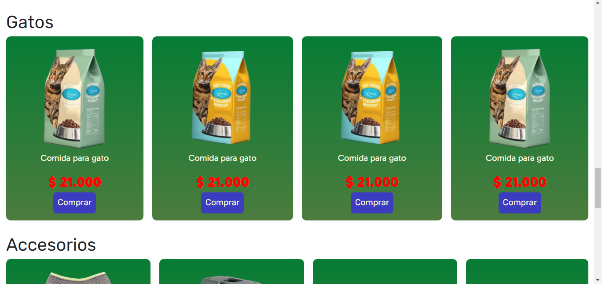
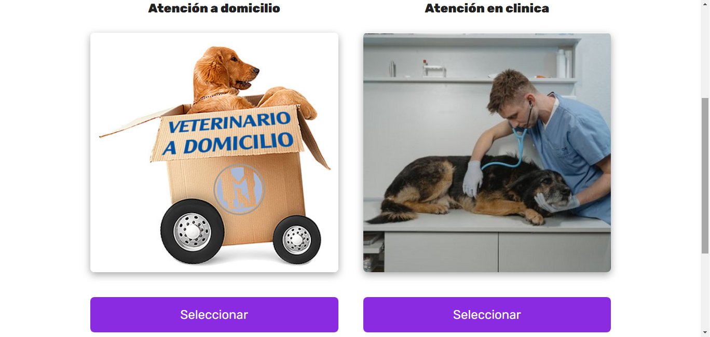

# Petshop
Petshop es un proyecto web realizado por Alfredo Ríos para el Trabajo Práctico Final de Programación Web inicial front-end de [BA Multiplica 2023](https://buenosaires.gob.ar/desarrolloeconomico/bajoven/ba-multiplica-20 "BA Multiplica").

La página consiste un portal online de venta de productos para mascotas con la posibilidad de sacar turno para el veterinario.

## Acceder al sitio
[https://alfredorios2590.github.io/Petshop/](https://alfredorios2590.github.io/Petshop/ "https://alfredorios2590.github.io/Petshop/")

### Screenshots
#### Encabezado

#### Turno

#### Servicios

#### Tipo de atención
